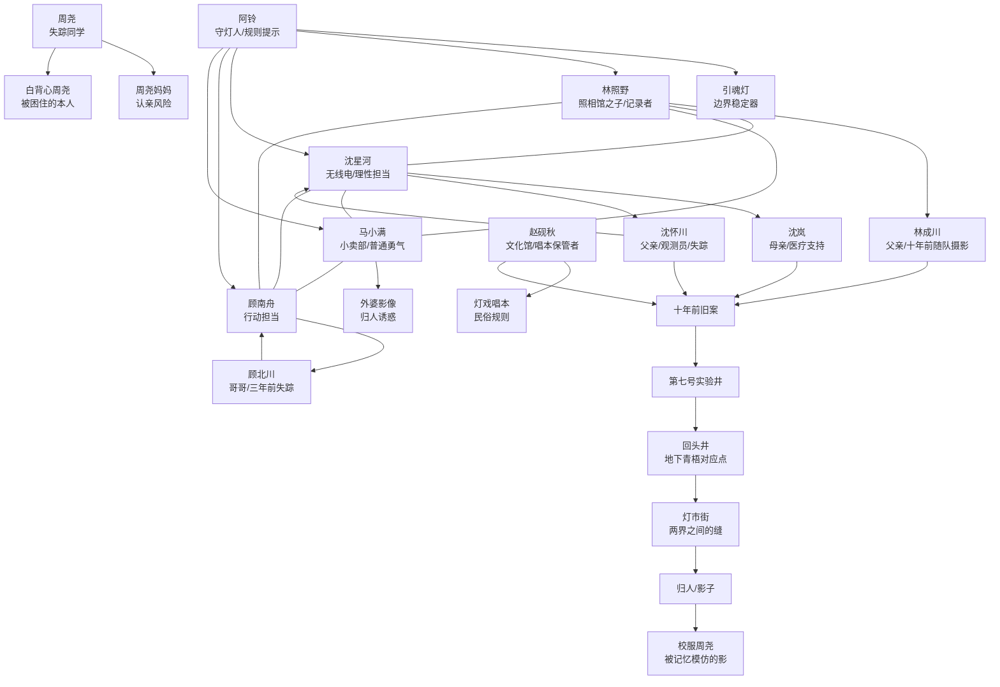

# 前十章行文脉络与人物关系

## 行文脉络

第一章《暑假第一天》：用暑假放学、小卖部门口、雾岭水泵房建立少年群像和县城质感。周尧追灯失踪，照片里出现失踪后的周尧。

第二章《旧电影院》：孩子们追查红色拨浪鼓，进入青梧影剧院，发现银幕后通向防空洞，墙上画着现实不存在的灯市街和回头井。

第三章《反着的门牌》：四人第一次误入灯市街，看见反着的门牌、马小满外婆、回头井和阿铃。林照野拍到未来日期里的林成川。

第四章《两个周尧》：林成川承认灯市街是“缝”。孩子们在水泵房看见白背心周尧和校服周尧，沈岚失控说出沈星河父亲在那里没的。

第五章《灯戏唱本》：赵砚秋登场，灯戏唱本揭示引魂灯、归人、认影为亲的民俗规则。顾北川三年前查过唱本。阿铃说明影子会借人名和亲情长出形。

第六章《实验井》：沈岚揭开十年前地磁异常观测项目，第七号实验井与回头井重叠。沈怀川录音留下真正警告：不要认影，不要让七月十五的灯亮。

第七章《归人无声》：归人开始进入现实青梧。马小满外婆、两个周尧同时出现，周尧妈妈差点认错。阿铃给出山神庙线索。

第八章《山神庙》：孩子们和成人一起进入山神庙后的灯路。顾南舟经受顾北川诱惑，选择不认影。七点停电后，雾岭千灯亮起，牌楼出现。

第九章《引魂灯》：众人抵达祭台。两个周尧被判定为“活人与影相缠”。林照野和沈星河合力遮住引魂灯，阿铃拔出灯芯，白背心周尧获救。

第十章《雾岭灯火》：周尧回到现实，但记忆残缺。少年和成人关系缓和。最后照片显示阿铃、沈怀川、顾北川仍在更深处，年轻赵砚秋手持另一盏灯，引出第二卷。

## 线索推进

失踪线：周尧失踪 -> 两个周尧 -> 周尧妈妈差点认错 -> 引魂灯下剥离影子 -> 周尧获救。

民俗线：拨浪鼓 -> 灯戏唱词 -> 唱本缺页 -> 归人规则 -> 引魂灯必须遮灭。

实验线：照片异常 -> 第七号实验井 -> 沈怀川录音 -> 十年前未灭灯事故 -> 第二盏灯伏笔。

人物线：林照野理解父亲，沈星河放弃“找回父亲”改为“完成父亲未完的事”，马小满从胆小到守住母亲不认影，顾南舟从执着找哥哥到听懂哥哥留下的保护。

## 人物关系图

## 后续伏笔

赵砚秋年轻时手持第二盏灯，说明他不是单纯的资料保管者。他可能参与了第一次引魂灯失控，甚至保留了另一条灯路。

阿铃、沈怀川、顾北川仍在更深处，意味着“救回周尧”只是关上第一道门。

第一盏灯已灭，第二盏灯将醒。第二卷可以转向更古老的青梧县、清代牌楼、赵砚秋的真实立场，以及阿铃成为守灯人的原因。
