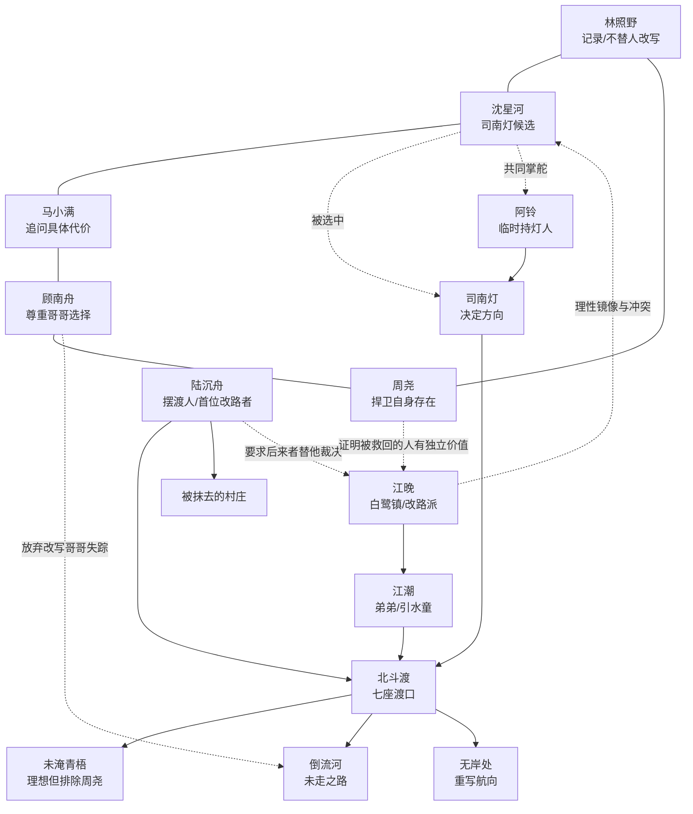

# 《雾岭灯火》第三卷：北斗渡

## 卷定位

时间在第二卷结束后的新学期开学周。

第一卷讨论“谁能回来”，第二卷讨论“谁有名字”，第三卷讨论“人该往哪里去”。北斗渡是一条连接七处异常地点的水路，船上的人能看见自己没有选择过的人生。它最大的诱惑不是让死者复活，而是允许活人改走另一条路。

核心命题：方向不是唯一正确的答案，而是一个人愿意承担后果的选择。

## 新世界规则

北斗渡不属于现实，也不属于地下青梧。它连接所有“有人走失却没有找到归处”的地方。

渡河上有七座渡口，对应北斗七星。每座渡口保存一种“未走之路”：没有发生的灾难、没有说出口的话、没有失去的人，以及没有成为的自己。

第三件核心器物是“司南灯”。它不管归路，也不管名字，只决定方向。持灯者可以改变某个人从分岔口之后的去向，但每改变一条路，现实就会失去另一条已经发生的路。

北斗渡的船不能同时靠两个岸。选择一个世界成为现实，另一个世界便会沉入渡河。

黑门上的七颗星不是锁，而是航图。七星全部点亮时，渡船会驶向“无岸处”，在那里重写航向。

## 新增人物

江晚，14 岁，来自白鹭镇。会游泳、认水路，性格果断。她的弟弟江潮在一次山洪中失踪。她比林照野更愿意牺牲少数人的现状，换取一条“更少人受伤”的路线。

陆沉舟，北斗渡的摆渡人。外表约五十岁，实际年龄不明。他不主动骗人，只给乘客看所有可能的岸。他认为选择没有善恶，只有代价是否被看见。

江潮，江晚的弟弟，失踪时 9 岁。他可能已经成为北斗渡的“引水童”，负责在七座渡口点亮航标。

## 十章结构

### 第二十一章《七星黑门》

开学第一天，学校花名册恢复正常，但所有指南针同时指向水库。林照野照片里的黑门出现在废弃水运码头，门上七星依次亮起。

一群孩子夜里梦游到码头，口中重复：“船要开了。”主角团队阻止梦游者时，黑门开启，阿铃的纸船从门后漂出。

章末钩子：纸船上写着“不要来找我”，背面却画着沈星河才懂的求救频率。

### 第二十二章《没有方向的船》

五人进入黑门，发现一艘没有船头船尾的木船。船上罗盘不停旋转，每个人看到的岸都不同。

他们遇见江晚。她来自同一年代的白鹭镇，已在船上寻找弟弟三个月，却坚称现实只过去三天。

章末钩子：渡船第一次靠岸，岸上是一个从未修建水库、也从未发生灯市街事件的青梧县。

### 第二十三章《未淹的青梧》

孩子们进入“未淹青梧”。林成川性格开朗，沈怀川还活着，顾北川在县剧团，马小满外婆坐在小卖部门口，一切都像理想生活。

代价逐渐显现：这个世界没有周尧，因为当年没有修水库，周尧父母从未迁来青梧。选择留下一个完美世界，会抹掉另一些真实存在的人。

章末钩子：沈怀川告诉沈星河，这不是假世界，而是一条真正可能成为现实的路。

### 第二十四章《摆渡人》

陆沉舟现身，解释七座渡口和司南灯。他不阻止任何人选择，只要求选择者亲口说出愿意舍弃的现实。

江晚表示愿用白鹭镇现有的一部分人生换回山洪中失踪的二十七人。她与团队产生根本分歧。

章末钩子：陆沉舟透露阿铃已成为司南灯的临时持灯人，但她正在被七条路线同时撕开。

### 第二十五章《倒流河》

为了找到阿铃，众人必须逆流经过第二、第三渡口。河流倒放人的选择：说过的话收回，迈出的脚步退回，伤口恢复，记忆却保留。

顾南舟获得一次回到哥哥失踪前的机会；沈星河可以阻止父亲进入实验井；林照野可以不拿起父亲的相机。

章末钩子：江晚偷偷改变一个选择，让弟弟江潮没有参加山洪当天的庙会，现实白鹭镇开始重写。

### 第二十六章《引水童》

江潮出现。他不是被困者，而是主动成为引水童，为北斗渡上找不到方向的人点航标。江晚拒绝接受弟弟已经做出自己的选择。

阿铃短暂现身，告诉林照野：司南灯正在寻找永久持有者，而所有候选者都必须失去原本的归处。

章末钩子：司南灯选中沈星河，因为她曾主动切断父亲的声音，证明她能放弃一条最想走的路。

### 第二十七章《星图失位》

江晚改动过去导致北斗七星位置错乱。不同渡口的现实互相侵入：青梧小学出现白鹭镇学生，县医院同时存在两个沈岚，周尧逐渐被未淹青梧排除。

沈星河若接受司南灯，可以恢复航向，却会永远无法回到青梧。团队第一次因是否牺牲一名成员而公开决裂。

章末钩子：林照野发现陆沉舟没有影子，他并非旁观者，而是第一个因改路失去现实的人。

### 第二十八章《七座渡口》

陆沉舟坦白：他曾为救女儿改写航向，结果让自己的村庄从现实消失。他留在渡河，是为了等待有人替他决定哪条路应当恢复。

团队分别守住七座渡口的航标，用各自真实经历证明“发生过的痛苦也属于现实，不能被未经同意地抹除”。

章末钩子：江晚点亮全部七星，渡船驶向能够重写所有路线的“无岸处”。

### 第二十九章《不靠岸》

无岸处展示两个完整方案：保留现有世界，所有失踪者维持原状；或重写灾难路线，让更多人活着，但现实中的部分人从未出生。

江晚必须面对：弟弟江潮明确选择留下当引水童；沈星河拒绝成为唯一持灯人，提出让所有乘客共同校准司南灯。

章末钩子：渡船结构开始崩裂，必须有人留在船上掌舵，陆沉舟准备重复自己的旧牺牲。

### 第三十章《北斗归航》

五名少年、江晚、江潮和阿铃共同完成“众人掌舵”：每个人只决定自己的方向，不替别人改路。司南灯被拆成七枚星钉，分别固定七座渡口。

陆沉舟终于离船，失去的村庄不被恢复，但被写进现实地图和地方志。江晚接受弟弟的选择，带着他的航标回白鹭镇。

结局：阿铃能够短暂回到青梧，却不再属于单一时代。沈星河保留一枚星钉，可以在真正需要时找到渡口，但不能用它改变过去。

尾声钩子：新学期地理课上，地图西北角多出一片从未被勘测的“无声林”。阿铃在窗外写下：那里没有灯，也没有名字。

## 主要人物弧线

林照野：从记录真相走向尊重他人不被记录、也不被改写的权利。他在未淹青梧里主动离开那个完整的父亲。

沈星河：面对成为司南灯持有者的诱惑。她拒绝以个人牺牲换取团队免责，推动“共同掌舵”的新规则。

马小满：继续承担普通人的尺度。他不断追问“谁会因此消失”，让宏大选择回到具体的人。

顾南舟：获得真正改写哥哥失踪的机会，却选择保留哥哥自主踏入灯路的决定。

周尧：在未淹青梧里不存在。他从“被救回的人”成长为主动捍卫自己存在价值的人。

阿铃：从送灯人转变为司南灯持有者候选。她终于不再只负责送别人，而开始选择自己的方向。

江晚：作为沈星河的镜像，她同样理性、勇敢，却更愿替多数人计算代价。她最终学会弟弟不是需要她修正的错误。

陆沉舟：代表“看见所有可能后无法再选择”的困境。他最终接受记录失去，比强行恢复失去更诚实。

## 人物关系图

## 写作节奏与道具

第二十一至二十三章：黑门、登船、理想世界，完成新谜面与第一次诱惑。

第二十四至二十六章：摆渡规则、倒流河、引水童，揭开江晚与阿铃的核心矛盾。

第二十七至三十章：星图失位、七渡口、无岸选择、共同掌舵，完成群像选择。

每章核心道具依次为：七星照片、无向罗盘、未寄出的明信片、船票、倒流沙漏、航标灯、错位星图、七枚铜钉、司南灯、星钉地图。
