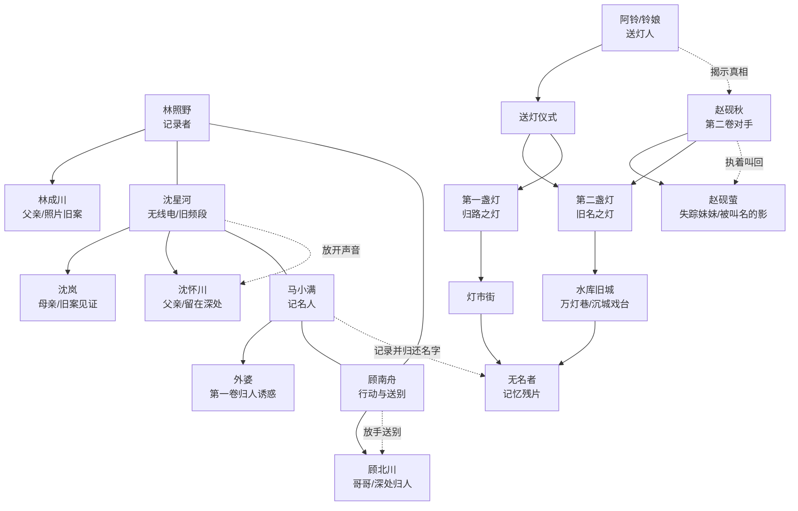

# 《雾岭灯火》第二卷：第二盏灯

## 卷定位

时间承接第一卷结尾，七月十五后的第七天。

第一卷解决的是“归人能不能回家”，第二卷要追问更危险的事：究竟是谁拥有点灯、灭灯和决定谁能回来的权力。

核心冲突不再是单纯阻止地下青梧进入现实，而是阻止赵砚秋借“第二盏灯”把两个时代的青梧重叠。他相信旧秩序需要恢复，孩子们则逐渐发现：所谓守灯，并不等于永远把门关死。

第二卷主题：记住不等于占有；拯救不等于替别人决定归处。

## 新增规则

第一盏灯管“归路”：让失散者沿记忆回到现实，也让影子学会模仿。

第二盏灯管“旧名”：它能让被遗忘的人重新拥有名字，但代价是现实中的同名者会开始失去自己。

两盏灯不可同时长明。第一盏灭，第二盏才会苏醒。

第二盏灯不在雾岭，而在被水库淹没的旧青梧县址。它只在“无月的雨夜”映入现实。

阿铃不是第一盏灯唯一的守灯人。她是最后一位“送灯人”，职责是把无法归家的人送往正确的路，而不是把他们困在任何一边。

## 十章结构

### 第十一章《第二盏灯》

开场：第一卷后第七天，青梧县开始出现奇怪的“失名”现象。有人忘了自己的小名，有人写不出家门牌号，周尧甚至忘记了马小满的名字。

推进：林照野洗出新的照片，照片背面出现一行水字：“旧名归位，活名让路。”赵砚秋连夜离开文化馆，带走了县志残卷。

章末钩子：林成川在照片中看见一个名字被擦掉的孩子，而那个孩子的脸是林照野。

### 第十二章《水库旧城》

开场：赵砚秋留下的借阅卡指向水库管理所。孩子们找到一张搬迁前的旧青梧地图，发现第二盏灯位于已被淹没的“万灯巷”。

推进：马小满带出小卖部的搬迁往事，他的母亲认识一位始终拒绝离开旧城的老人。老人提供一艘修堤船和一条禁忌：水面出现旧街时，不要叫出失去者的名字。

章末钩子：夜雨下，水库水面浮现出完整的旧青梧街道，街上所有门牌都没有号码，只有人名。

### 第十三章《没有名字的人》

开场：沈星河开始忘记父亲的脸，只记得收音机里的声音。她意识到第二盏灯正在从现实中“借名”。

推进：孩子们上船进入水面旧城，遇见一群没有名字的人。他们不是影子，也不是归人，而是第一盏灯熄灭后没能被送走的记忆残片。

章末钩子：其中一个无名人写下“阿铃”两个字，却说自己从未见过她。

### 第十四章《赵砚秋的旧年》

开场：林照野通过照片进入赵砚秋的旧记忆，看到年轻赵砚秋并非观测项目成员，而是十年前项目真正的民俗顾问。

推进：赵砚秋的妹妹赵砚萤在清代旧青梧的照片中出现。她在幼年时因山洪失踪，赵砚秋因此一生执着于“让被遗忘者拥有名字”。

章末钩子：赵砚秋在水库底部的旧戏台点亮第二盏灯，并说：“我只想把她叫回来。”

### 第十五章《阿铃的来处》

开场：阿铃在水面旧城现身，但她开始忘记现代词语，说明送灯人的身份被第二盏灯拉回旧时代。

推进：阿铃讲出真相：她原名“铃娘”，清末时是灯戏班的孩子。她不是死后成了守灯人，而是在一次送灯仪式里主动留下，替所有无名归人守住路口。

章末钩子：阿铃承认赵砚萤并不在地下青梧，赵砚秋点亮的东西只会长成“像妹妹的人”。

### 第十六章《同名之夜》

开场：第二盏灯的影响扩大。县城里同名的人开始交换记忆，户籍、病历、照片上的名字互相消失。

推进：周尧因为已被灯市街模仿过，成了最先被抹去“周尧”这个名字的人。白背心周尧与校服周尧的残留再次出现，逼迫大家重新面对第一卷的创伤。

章末钩子：林照野的照片里出现两个“林照野”，一个站在现实照相馆，一个站在旧城牌楼下。

### 第十七章《沉城戏台》

开场：顾南舟从顾北川留下的戏票背面发现一段武生步法，它是进入水库底部旧戏台的唯一路线。

推进：团队分成两线：林照野、沈星河、马小满下潜旧城找灯芯；顾南舟和阿铃去阻止赵砚秋完成“叫名”。成年人在水库堤坝组织撤离，但无法替代孩子做选择。

章末钩子：顾北川出现，告诉顾南舟自己能回来，条件是让赵砚秋完成最后一次唱名。

### 第十八章《叫名的人》

开场：赵砚秋在沉城戏台摆下空座，开始逐一叫出归人的名字。每叫一个名字，现实中便有一个活人失去身份。

推进：沈星河选择在父亲的名字被叫出前切断旧频段；林照野发现第二盏灯真正的作用不是复活，而是让活人与亡者共享同一个“名字位置”。

章末钩子：赵砚秋叫出“赵砚萤”，戏台帘幕后走出一个与他记忆一模一样的小女孩。

### 第十九章《送灯》

开场：赵砚萤看似归来，却拒绝叫赵砚秋哥哥。她知道所有人的秘密，却没有自己的影子。

推进：阿铃提出唯一的解法：不灭第二盏灯，而是将两盏灯合为“送灯”，让所有无名者走向各自该去的方向。代价是阿铃会彻底忘记自己，也会失去回到现实的机会。

章末钩子：顾南舟决定不留下顾北川，赵砚秋也终于承认他等的不是妹妹，而是自己不肯放下的那个夜晚。

### 第二十章《万灯归处》

开场：水库旧城、灯市街、现实青梧三层重叠。每家每户门前都亮起一盏灯，名字正在从门牌上流走。

推进：少年团队各自完成选择：林照野不认另一个自己；沈星河放开父亲的声音；马小满替无名者写下最后一份归人名单；顾南舟送走哥哥；赵砚秋放下妹妹。阿铃完成送灯仪式。

结局：第二盏灯熄灭，第一盏灯不再被任何一个人独占。旧城沉回水底，现实名字恢复。

尾声钩子：阿铃不见了，但林照野洗出的照片里，万灯巷尽头多出一扇从未见过的门，门牌写着“第三卷：北斗渡”。

## 人物弧线

林照野：第一卷学会不认影子；第二卷要学会不把“真相”当成占有他人的权利。他最终放弃拍下阿铃离开的瞬间，第一次主动把相机放下。

沈星河：从“我要找回父亲”走到“我要允许父亲拥有自己的归处”。她把收音机修成送灯仪式的一部分，但不再试图从里面听见父亲。

马小满：从守住母亲不认外婆，走到替无名者记录名字。他成为团队的“记名人”，证明普通人的记忆也能抵抗遗忘。

顾南舟：从听懂哥哥的保护，走到主动送哥哥离开。他用戏台武生步法打开旧戏台，也用它完成最后一次送别。

阿铃：从规则的传话者，成为有名字、有选择的孩子。她最终不再只是守灯人，而是决定把灯路交还给活人。

赵砚秋：从知识型阻碍者变成悲剧性对手。他的错误不是爱妹妹，而是试图让所有人替他的失去付出身份代价。

## 人物关系图

## 写作节奏

第十一至十三章是“异常扩散与入城”，以失名、水库旧城、无名者建立新谜面。

第十四至十六章是“赵砚秋与阿铃的过去”，让对手动机与世界规则同时转向。

第十七至二十章是“沉城戏台与送灯仪式”，每位主角各自完成一次不认、放开或送别。

第二卷仍应维持每章一个具体道具：水字照片、旧城地图、无名牌、赵砚萤照片、送灯灯笼、归人名单、戏票、点名册、灯芯、万灯门牌。
