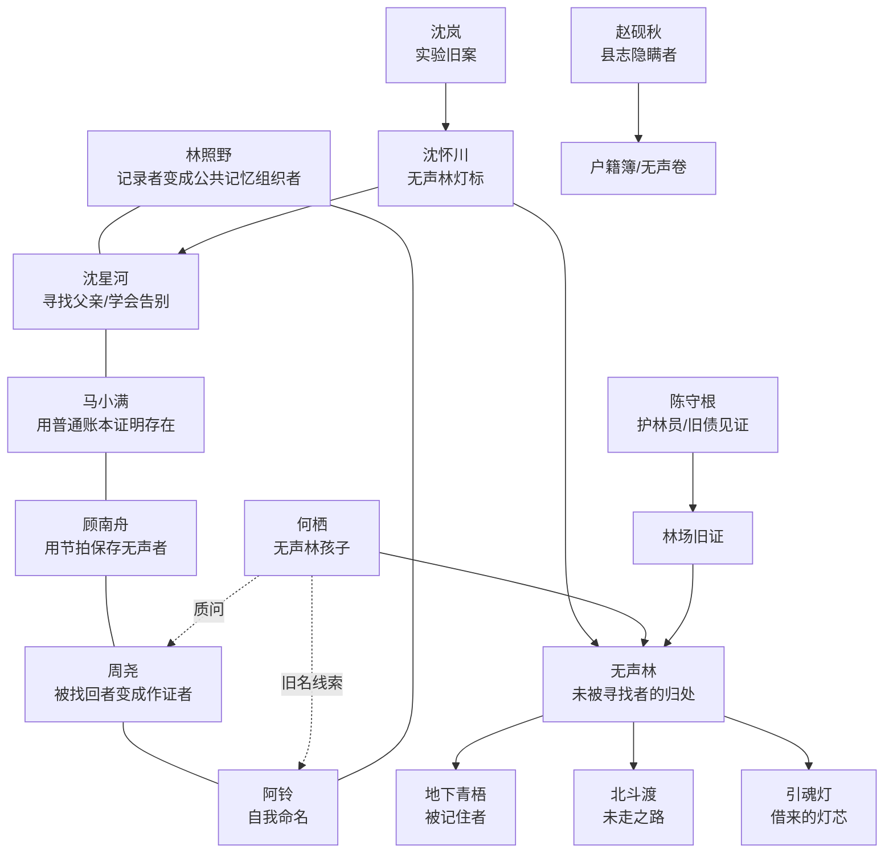

# 《雾岭灯火》第四卷：无声林

## 卷定位

时间在第三卷结束后的深秋，青梧县开始修通往雾岭西北林区的新路。

第一卷讨论“谁能回来”，第二卷讨论“谁有名字”，第三卷讨论“人该往哪里去”。第四卷作为大结局，讨论“谁有资格被记住”。

无声林不是地下青梧，也不是北斗渡。地下青梧保存被强烈记住的人，北斗渡保存未走之路，无声林保存的是那些从一开始就没有被记录、没有被寻找、没有资格成为“失踪者”的人。

核心命题：真正可怕的不是有人失踪，而是有人消失后，从未有人承认他曾经存在。

## 新世界规则

无声林没有灯，也没有名字。进入林区的人会先失去声音，再失去被别人提起的机会，最后从账本、照片、花名册和记忆里变成一块空白。

无声林不会主动杀人。它只收回被现实借走的东西：声音、灯芯、名字和路。

引魂灯最早的灯芯来自无声林。旧青梧人为了让走失者有路可回，把一座山寨的名字、声音和火种献给了森林。地下青梧与北斗渡后来出现的所有灯路，都建立在这笔未被写进县志的旧债上。

照片能拍到无声林的轮廓，却拍不到林中人的脸。录音机能录下林中人的停顿，却录不到名字。戏曲锣鼓能在无声处留下节拍，因为节拍先于语言。

只有一种办法能结束无声林的扩张：让现实世界公开承认那些从未被登记的人，并把“寻找”从私人执念变成共同记忆。名字不能被一个英雄替所有人喊出，必须由仍然愿意回应的人接住。

## 新增人物

陈守根，六十多岁，雾岭林场退休护林员。年轻时参与封林、修路和灯芯采伐。他知道无声林真实存在，却一直把它当作“不能说的山规”。

何栖，外表十三四岁，来自无声林边缘的孩子。他不是迷路的人，而是“从未被登记的人”的后代。他能听见别人遗忘前的最后一口气。

沈怀川，沈星河失踪的父亲。他没有死，也不完整地活着，而是在无声林边界维持无线电灯标。他的声音每被现实接收一次，林中就会有一个旧名字短暂亮起。

## 十章结构

### 第三十一章《地图上的空白》

地理课上，地图西北角的无声林继续扩大。学校广播突然失声，只有阿铃能听见窗外有人敲树。

林照野拍下地图，却发现照片上多出一条现实没有的林场公路。公路尽头写着“青梧县第零生产队”。

章末钩子：班级花名册里多出一行空白，周尧却指着那一行说：“昨天这里坐着一个人。”

### 第三十二章《没有声音的早读》

青梧小学早读课失去声音，孩子们张嘴背书，却没有一个字传出来。马小满发现小卖部账本里有几页货款记录变成空白。

沈星河用收音机捕捉到父亲的短促呼叫：不要点灯，找树。

章末钩子：阿铃胸前姓名牌上的“阿铃”二字褪掉，只剩一个针孔。

### 第三十三章《林场旧证》

主角团进入废弃林场，找到陈守根留下的伐木证、护林日志和一张从未上报的事故照片。

他们得知旧青梧曾有“第零生产队”，成员没有户籍，负责在雾岭深处采灯芯木。后来整支队伍被从县志里抹掉。

章末钩子：事故照片背面写着一排名字，林照野刚读出第一个，自己的声音就消失了半分钟。

### 第三十四章《不响的铃》

阿铃被无声林召回。她发现自己并不是单纯的送灯人，而是第零生产队最后一个孩子留下的“铃声”。

顾南舟用戏曲身段和锣鼓节拍与无声林沟通。锣声响不出来，但鼓槌落下时，树影会后退一步。

章末钩子：何栖出现，告诉他们：“你们找失踪的人，我们找从没被找过的人。”

### 第三十五章《空白户口簿》

沈岚和赵砚秋带孩子们潜入旧户籍室，寻找第零生产队的原始登记页。档案柜里所有纸张都在变白。

马小满用小卖部赊账本证明那些人曾买过盐、火柴和红糖。普通生活记录成了比县志更可靠的证据。

章末钩子：户口簿恢复出第一个名字，现实中却有一盏路灯永久熄灭。

### 第三十六章《无名戏》

县剧团旧戏台上出现一出没有唱词的灯戏。顾南舟认出哥哥顾北川当年曾排练过这出戏，目的不是招魂，而是替不能说话的人留节拍。

周尧第一次主动站到台上。他明白自己被救回后，不能只证明自己是真的，也要替那些无人证明的人作证。

章末钩子：无名戏最后一幕，沈怀川的影子从幕布后走过，手里拿着一盏没有火的灯。

### 第三十七章《树心里的灯》

孩子们进入无声林核心。树心里没有年轮，只有一圈圈被借走的灯火。每一盏引魂灯、司南灯和星钉都曾从这里取过一点火。

沈星河终于见到父亲。沈怀川告诉她：他不能回家，因为他的声音已经变成林中灯标；一旦离开，无声林会吞掉青梧所有被借来的灯。

章末钩子：沈星河的星钉指向阿铃，而不是指向出口。

### 第三十八章《县城静音》

无声林扩张到县城。广播、课堂、照相馆快门、医院呼叫铃、小卖部算盘声全部消失。人们开始忘记第一个被抹掉的邻居是谁。

林照野放弃用相机独自记录，带领全县人把旧账本、照片、戏票、病历、借条和墓碑拓片搬到广场。

章末钩子：广场上所有证据堆成一座“无声县志”，但第一页仍然没有标题。

### 第三十九章《把名字还给森林》

众人共同朗读恢复出的名字。每喊出一个名字，就必须有人讲出一件具体小事：他买过什么、修过哪条路、欠过谁的钱、唱过哪句戏。

阿铃终于找回自己的旧名，却选择不完全回到过去。她把旧名还给无声林，把“阿铃”留给现在的自己。

章末钩子：无声林停止扩张，但要求最后一个问题的回答：如果没有人记得你，你还愿意记得别人吗？

### 第四十章《雾岭天亮》

最终章不靠牺牲关闭世界，而靠共同承认旧债。青梧县把第零生产队写入地方志，把无声林标进地图，把灯芯木列为禁伐。

沈怀川的声音最后一次通过收音机传来，与沈星河告别。林照野拍下第一张能显出无声林人脸的照片，但照片背面没有“失踪”，只有“曾在”。

结局：雾岭第一次在清晨散雾。阿铃参加期末考试，周尧在作文里写“我被找过，所以我要找别人”。孩子们升上初中前，收到一封没有邮票的信，信上只有一句话：下一盏灯，不必再为死人点。

## 主要人物弧线

林照野：从“我要证明真相”走向“真相不能只由我一个人保存”。他把相机从证据工具变成公共记忆的一部分。

沈星河：从寻找父亲的声音，走向理解父亲为什么留下。她不再把告别看作失败。

马小满：从普通人的勇气走向普通人的记忆。他证明历史不只在县志里，也在赊账、闲话、糖纸和小票里。

顾南舟：从行动担当走向节拍守护者。他接受有些人不能被语言带回，却能被身体、戏和节奏记住。

周尧：从被救回的人走向作证的人。他最懂“差一点不存在”的恐惧，因此主动为无人寻找者发声。

阿铃：从没有归属的送灯人走向自我命名的人。她不再只是旧债的残响，而成为青梧当下生活的一员。

沈怀川：从失踪父亲变成守界者。他的结局不是回家，而是被家人和县城公开承认。

何栖：代表无声林里的孩子。他不是反派，而是对现实提出质问的人：凭什么只有被你们爱过的人才值得回来？

## 人物关系图

## 写作节奏与道具

第三十一至三十三章：地图扩张、学校失声、林场旧证，建立终局谜面。

第三十四至三十六章：阿铃旧身世、何栖质问、空白户籍、无名戏，揭开无声林与青梧旧债。

第三十七至四十章：树心灯源、县城静音、共同命名、雾岭天亮，完成系列大结局。

每章核心道具依次为：空白地图、失声广播、伐木证、不响铜铃、空白户口簿、无名戏谱、树心灯火、无声县志、旧名木牌、第一张显影照片。
